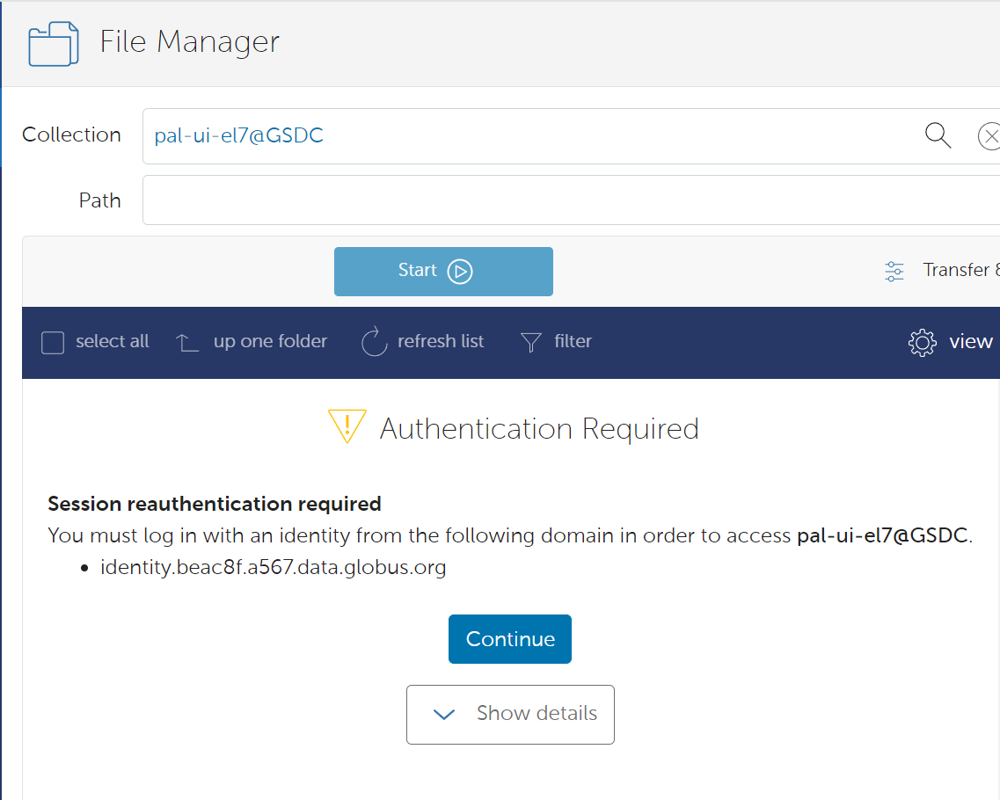

=============================
Data Transfer
=============================

Globus Online
-------------------------------

KISTI GSDC has the Globus online endpoints, which are set as pal-ui-el7@gsdc-pal.

Steps to transfer data:
1. Sign up for Globus online and log in (supports CILogon, Google, ORCID iD, globus id).
2. Search for the GSDC-PAL collection using the keyword “gsdc-pal”.

    Now you can use only the **"pal-ui-el7@GSDC"** endpoints.

3. Log in with your KISTI account (being able to access your home and group directory).

    Please choose **continue**. And then the select your identity or identity provider to continue.

    You can login with your kisti account and password.
        - If you generated an OTP token, then you should input **<password+OTP>** at password field.
        (ex) password: *1q2w3e4r* and OTP: 123 456, then your password is *"1q2w3e4r123456"*

4. Add your endpoint by downloading and installing “Globus Connect Personal”.
5. Transfer your data from the GSDC-PAL collection to your personal collection.

Please note that the transmission performance of Globus online depends entirely on network conditions. KISTI supports high-performance network infrastructure to provide research resources to approximately 200 R&D institutes.
