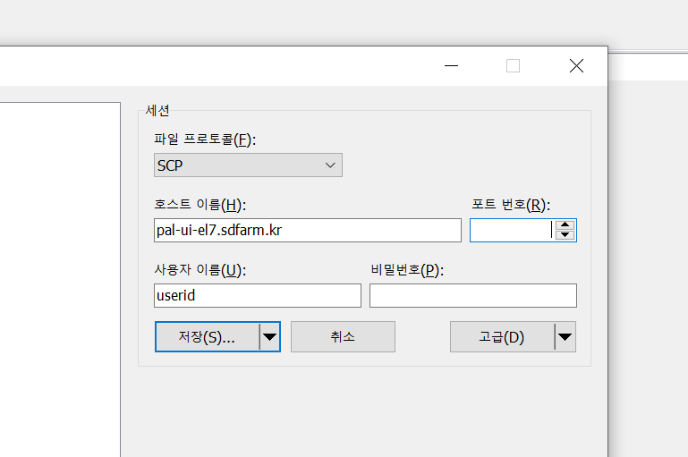

================
Data Transfer
================

You can transfer data using SFTP and Globus Online.

SFTP (Secure File Transfer Protocol, SecureFTP)
--------------------------------------------------------------

You can access PAL UI server by FTP software like Filezilla, winSCP, etc.
    - Protocol: SFTP or SCP
    - Host: pal-ui-el7.sdfarm.kr / pal-ui02-el7.sdfarm.kr / pal-ui.sdfarm.kr
    - Port: XXXX
        * The SSH port number will be provided upon account creation.
    - Account: KISTI account and password
        * Note: please refer to the `OTP Guide - Login with OTP <https://gsdc-farm.gitbook.io/gsdc-otp/login-with-otp>`_. 
    

Globus Online
--------------------------------------------------------------

KISTI GSDC has the Globus online endpoints, which is set as pal-ui-el7@GSDC.

    Steps to transfer data:

    1. Sign up for Globus online and log in (supports CILogon, Google, ORCID iD, globus id).

    2. Download and install "globus connect personal" and setup your personal collection.

        .. image:: ../images/globusconnectpersonal.png
            :scale: 50 %
            :align: center

        .. image:: ../images/highassurance.png
            :scale: 50 %
            :align: center
    
        .. warning::
            Do not select the "High Assurance" option during login and setup the Globus Connect Personal.
        
    3. Search for the GSDC-PAL collection using the keyword “gsdc-pal”.

        .. warning::
            now you can use only the **"pal-ui-el7@GSDC"** endpoints.

        .. image:: ../images/globus_1.png
            :scale: 70 %
            :align: center

    4. Log in with your KISTI account (being able to access your home and group directory).

        4.1. Please choose **continue**. And then select your identity or identity provider to continue.

        .. image:: ../images/globus_2.png
            :scale: 50 %
            :align: center

        4.2. you can log in with your KISTI account and password.

           - If you generated an OTP token, then you should input **<password+OTP>** at the password field.
           
             (ex) password: *1q2w3e4r* and OTP: 123 456, then your password is *"1q2w3e4r123456"*

        .. image:: ../images/globus_3.png
            :scale: 70 %
            :align: center

    5. Transfer your data from the GSDC-PAL collection to your personal collection.

Please note that the transmission performance of Globus online depends entirely on network conditions. KISTI supports high-performance network infrastructure to provide research resources to approximately 200 R&D institutes.
