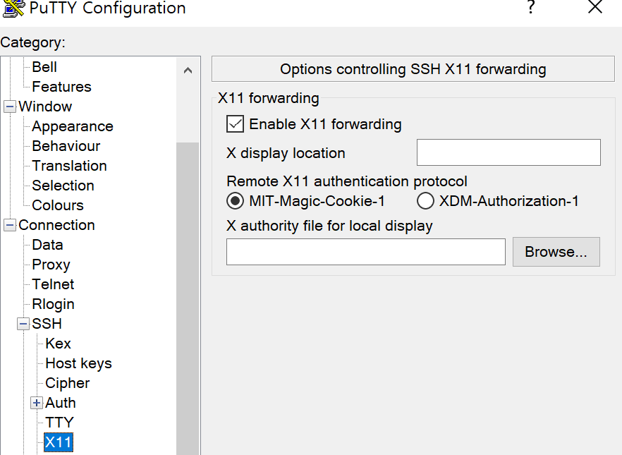
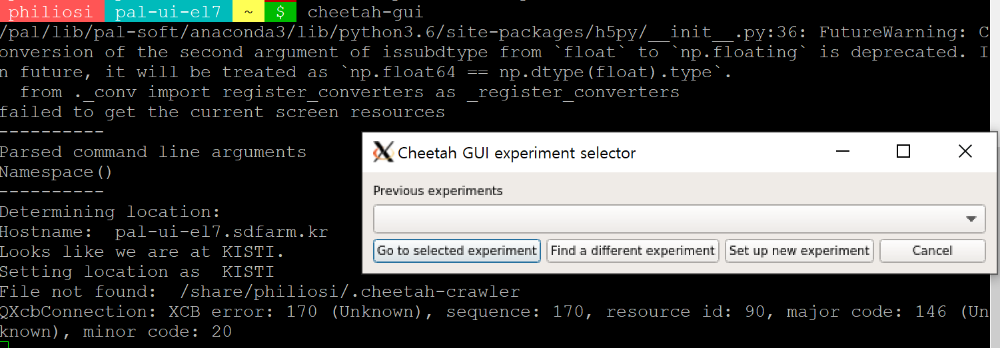
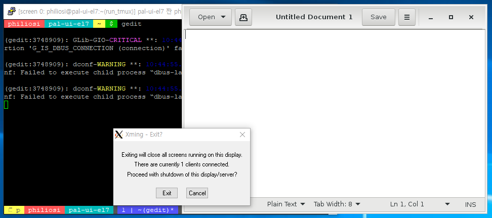

============================
GUI Applications
============================

You can use GUI applications such as cheetah-gui and gedit with an X11 display server, depending on your operating system.

For Putty and Xming on Windows:
- Install the X11 display server like Xming.
- Enable the "X11 forwarding" option.

- Execute the applications.

