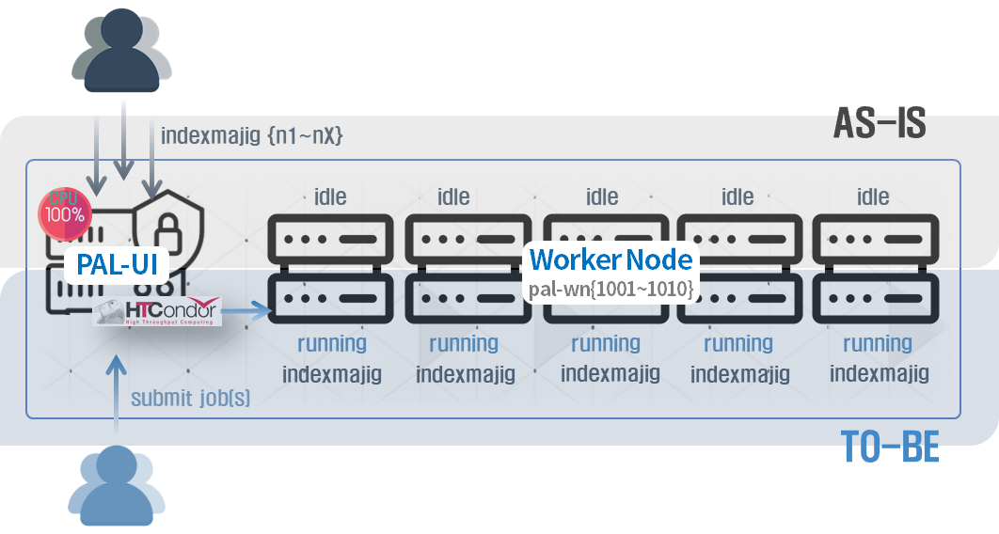

Section 1 Introduction
==========

Section 1.1 CrystFEL
----------------------------------------------------------------------------

* CrystFEL[web site] is a suite of programs for processing diffraction data acquired "serially" in a "snapshot" manner, such as when using the technique of Serial Femtosecond Crystallography (SFX) with a free-electron laser source. CrystFEL comprises programs for indexing and integrating diffraction patterns, scaling and merging intensities, simulating patterns, calculating figures of merit for the data and visualising the results. Supporting scripts are provided to help at all stages, including importing data into CCP4 for further processing.
.. [web site] CrystFEL - https://www.desy.de/~twhite/crystfel/

Section 1.2 HTcondor
--------------------------------------------------

* HTCondor Software Suite (HTCSS) provides an array of services for automating and managing High Throughput workloads and computing capacity.::

    HTCondor is a software system that creates a High-Throughput Computing (HTC) environment. It effectively uses the computing power of machines connected over a network, be they a single cluster, a set of clusters on a campus, cloud resources either standalone or temporarily joined to a local cluster, or international grids. Power comes from the ability to effectively harness shared resources with distributed ownership.

    A user submits jobs to HTCondor. HTCondor finds available machines and begins running the jobs there. HTCondor has the capability to detect that a machine running a job is no longer available (perhaps the machine crashed, or maybe it prefers to run another job). HTCondor will automatically restart the job on another machine without intervention from the user.

    HTCondor is useful when a job must be run many (thousands of) times, perhaps with hundreds of different data sets. With one command, all of the jobs are submitted to HTCondor. Depending upon the number of machines in the HTCondor pool, hundreds of otherwise idle machines can be running the jobs at any given moment.

    - HTCondor overview[HTConodr]
    .. [HTCondor] HTCondor - https://htcondor.org/

